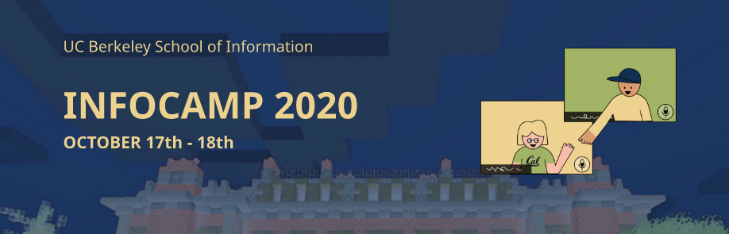

# CourseDash

    

## Team: The Zoom Roomies

Members: Seth Hamlin, Grace Lam, Mein Lee, Maxson Yang

## About CourseDash

CourseDash is a proof-of-concept web platform that uses NLP to classify questions on Q&A platforms according to their level of understanding using Bloom's Taxonomy. By analyzing categorizing questions being asked based on topic and difficulty, we provide educators with the means to quantify understanding using a well-established pedagogical model.

### Background

Our team developed CourseDash as a proof-of-concept for InfoCamp 2020, an appathon held by UC Berkeley's School of Information. Teams were given the challenge to *come up with an idea for better assessing the impact of a learning experience, which considers ways for businesses and educators to improve over time*.

Given a 24 hour period, we ideated and iterated on our idea, delivering a prototype web platform. Following the 24 hour period, we presented our product and received runner up in the Engineering/Data Science track of the appathon.

### Design Process

Our team started with an ideation phase, where we discussed potential ideas to answer the prompt, converged on ideas we liked, and refined our end goal. For our solution, we decided to create a web platform and a basic classifier to categorize questions. Question data was sourced from the Summer 2020 class of CS10. We then split up the work for developing the front-end, the Django back-end, and data analysis/model development between the team members.

## Dependencies

Django v3.1+
You can run 'pip3 install Django' if you don't already have it installed.

## Instructions for Running

1. In Terminal, make sure you are in the same directory as the manage.py file.
2. Type: 'python3 manage.py runserver'
3. Navigate to the url provided to you.
